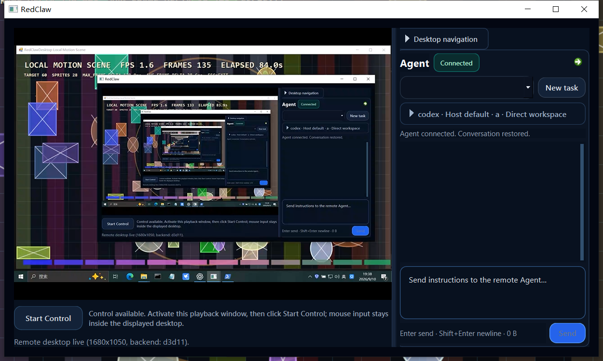

<div align="center">

# RedClawDesktop

**A Windows P2P remote desktop and remote Agent workspace for developers**

[简体中文](README.md) · [Download v0.1.3](https://github.com/70565912/RedClawDesktop/releases/tag/v0.1.3) · [Developer docs](docs/README.md) · [Issues](https://github.com/70565912/RedClawDesktop/issues)

[](https://github.com/70565912/RedClawDesktop/releases/tag/v0.1.3)
[](https://github.com/70565912/RedClawDesktop/releases/tag/v0.1.3)
[](LICENSE)
[](CMakeLists.txt)
[](https://www.qt.io/)

</div>

RedClawDesktop connects a developer to their own Windows workstation by device code. One GUI combines the live desktop, explicitly authorized keyboard and mouse input, and interaction with AI coding Agents running on the Host. Online DHT rendezvous and ICE/STUN/TURN negotiation are used to establish a direct P2P connection whenever possible.

> `v0.1.3` is a Windows x64 Developer Preview combining capture recovery, Host cursor handling, and a file/clipboard/terminal workspace. It has no signed installer and does not claim coverage of every cross-site NAT and TURN combination. See the [release notes](docs/releases/v0.1.3.md).



## Why RedClawDesktop

- **Built for development work**: desktop video, remote input, and Agent output share one workspace.
- **Device-code connection**: the normal product flow never asks for the peer's IP address.
- **Direct first**: DHT provides online rendezvous while ICE/STUN/TURN handles connection negotiation and NAT traversal.
- **Real media path**: the Host captures and encodes the desktop; the Controller decodes and presents it. A diagnostic preview is not accepted as proof of the real path.
- **Explicit authority**: remote input, unattended operation, and Agent tasks are bounded by user authorization, leases, and registered projects.

## Current capabilities

| Capability | v0.1.3 status |
| --- | --- |
| Windows Host and Controller GUI | Available |
| Device code and public-DHT rendezvous | Available |
| ICE/STUN direct connection and configurable TURN | Available; network coverage is still expanding |
| WGC and Desktop Duplication capture | Available |
| H.264/HEVC codecs and D3D11 presentation | Available; backend depends on hardware and drivers |
| Authorized keyboard and mouse control | Available; secure-desktop cases fail closed |
| Control, Media, and Agent channels | Available |
| Codex and Cursor provider bridge | Available after Host-side setup and authorization |
| Bidirectional file and folder transfer | Available with SHA256 verification, conflicts, cancellation and per-file results |
| On-demand clipboard transfer | Remote-canvas Ctrl+V triggers a snapshot, not continuous sync; focus and input gates apply |
| Embedded PowerShell terminal | ConPTY with bundled WebView2/xterm.js; same-session reconnect retains the shell |
| Independent restart and full-directory upgrade | Current-user worker, startup rollback, independent of the initiating Agent/terminal |
| Signed Windows MSI and mobile clients | Planned |

## Quick start

1. Download `RedClawDesktop-windows-x64-v0.1.3.zip` and `SHA256SUMS.txt` from the [v0.1.3 Release](https://github.com/70565912/RedClawDesktop/releases/tag/v0.1.3).
2. Verify the archive:

   ```powershell
   Get-FileHash .\RedClawDesktop-windows-x64-v0.1.3.zip -Algorithm SHA256
   ```

3. Extract it into a new directory and run `redclaw_desktop.exe`. Supported Host and Controller versions negotiate their common capabilities; connecting does not require identical versions or binaries.
4. Select **Host** on the controlled PC and wait. Select **Controller** on the controlling PC, enter the Host device code, and connect.
5. Once video is visible, enable remote input explicitly. Agent features also require a configured provider and registered projects on the Host.

File, clipboard and terminal features use common negotiated capabilities. Unsupported features stay unavailable with older peers; both sides need not upgrade together. Transfers pause new desktop/terminal input and Agent operations while video and existing output continue. Completion or cancellation restores only operations still eligible under their other authorization gates.

The portable archive does not install a Windows service. Windows SmartScreen may warn because this Developer Preview is not code-signed.

## ICE UDP port and router setup

- The default ICE UDP port is **55000** and can be changed in the GUI network settings.
- Two different machines can both use 55000. Two instances on one machine need different ports; the project test scripts use Host 55000 and Controller 55001.
- When UPnP is enabled, RedClawDesktop maps the actual ICE UDP port. A UPnP failure is visible in diagnostics and does not disable STUN, TURN, or ordinary hole punching.
- For a manual router rule, select **UDP** and use the configured ICE port for both the internal and external port.
- The DHT listening port is used only for rendezvous and does not need a manual mapping.

Direct connectivity depends on NAT, CGNAT, firewall, and ISP policy. Configure TURN when direct traversal is unavailable. The current version has not been tested across every network combination.

## GitHub cloud validation boundary

GitHub Actions uses a newly provisioned Windows virtual machine for each job. Dependencies already installed in a developer's local vcpkg tree are not available in that VM. The unit workflow installs its own Qt, FFmpeg, and other dependencies during CMake configuration. Matching vcpkg revisions and dependency manifests reuse a hosted binary cache; a missing cache or a dependency change still requires one longer build.

After a prerelease is published, a separate package check downloads the final ZIP from GitHub Releases, verifies it against `SHA256SUMS.txt`, checks required portable files, and runs `redclaw_desktop.exe --help` from the archive. It does not rebuild the application; it detects damaged uploads, missing DLLs, and a broken command entry point.

The GitHub-hosted VM is not a real desktop acceptance environment. Automated sequences and release requirements contain only unattended cases. Physical keys, application paste, UAC/account interaction, special hardware/topology and visual judgment are optional developer evaluations, not pending release gates. Unexecuted coverage is not a pass. See the [automated matrix](docs/testing/test-matrix.md) and [GitHub Actions validation](docs/testing/github-actions-validation.md).

## Security model

- Remote input is rejected when capability, authorization, lease, or lifecycle state is missing.
- Agents can work only inside projects registered by the Host. The terminal is a separate connected-desktop capability executing with the Host's current-user permissions, without automatic elevation; file browsing also obeys that user's filesystem permissions.
- Diagnostics bound sensitive paths, addresses, and credentials. Runtime signaling, keys, and local configuration must never be committed.
- Local encrypted debug signaling files remain in operator-selected directories; the repository is not a communication or signaling exchange.

See the [solution architecture](docs/architecture/solution-architecture.md), [ordinary desktop input design](docs/architecture/ordinary-desktop-remote-input-v1.md), and [remote Agent bridge design](docs/architecture/remote-development-agent-bridge-v1.md).

## Build from source

Requirements: Windows 10/11 x64, Visual Studio 2022, CMake 3.20+, vcpkg, and Qt 6 Widgets. Copy `CMakeUserPresets.example.json` to the local-only `CMakeUserPresets.json`, set your dependency paths, then run:

```powershell
.\build.ps1
.\build.ps1 -Configuration Release
```

The standard entry point builds the project and stages a runnable tree under `release\Debug\` or `release\Release\`. Do not replace it with a bare `cmake --build` for the main application because the staged binaries may remain stale. See the [developer documentation index](docs/README.md).

## Project status

`v0.1.3` retains the real desktop and Control/Media/Agent baseline and adds negotiated remote workspace capabilities. Automated acceptance is separate from optional manual development evaluation; local endpoint evidence is not proof of all cross-site networks. Strict performance targets remain engineering observations dependent on hardware, drivers, resolution, and network conditions.

The next phase expands cross-site and TURN coverage, hardens unattended install and upgrade, adds code signing, and continues reducing GUI scheduling cost during large Agent output. See [PROJECT_STATE.md](docs/runtime/PROJECT_STATE.md).

## Contributing and license

Issues and pull requests are welcome. Read [CONTRIBUTING.md](CONTRIBUTING.md) and the [developer documentation index](docs/README.md). Report security issues privately according to [SECURITY.md](SECURITY.md).

RedClawDesktop is licensed under [Apache License 2.0](LICENSE). Distributed third-party components retain their own licenses; see [THIRD_PARTY_NOTICES.md](THIRD_PARTY_NOTICES.md) and `third_party/licenses/`.
